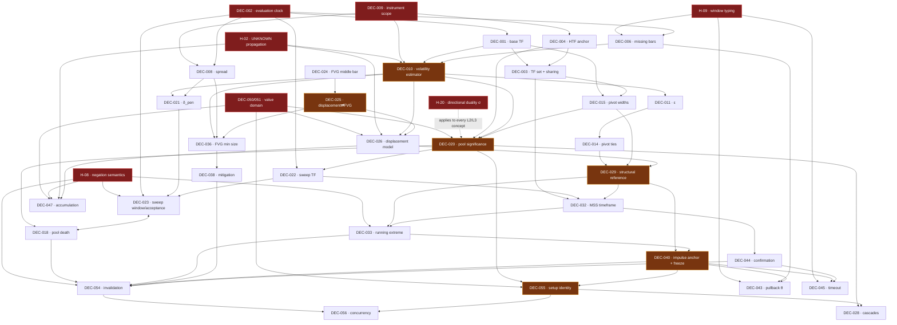

# DEP-001 — Dependency Analysis of the Specification

*The specification treated as a formal system. Not what the methodology says —
what its definitions **depend on**, and what shape that dependency relation has.*

**Method.** Every open decision and every concept is a node. An edge `X → Y`
means: *Y cannot be given a well-formed definition until X is settled.* Not
"Y is influenced by X" — that relation is dense and useless. The relation used
here is **definitional dependency**: if changing X would force the text of Y to
be rewritten rather than merely renumbered, the edge exists.

That distinction is what makes the graph informative. A decision that changes
*values* downstream is a different object from one that changes *definitions*
downstream, and Phase 1 did not separate them.

---

## 0. Summary of findings

Six results, in descending order of consequence.

1. **The register's tiering is wrong.** Phase 1 tiered by urgency (what blocks a
   trader from seeing signals). The architectural ordering is different: only
   **7 of the 13 Tier A items** are architecturally load-bearing, and **three
   Tier C items are constitutional**. Details in §5.
2. **The single highest-fanout decision in the system is `DEC-050`, currently
   filed as Tier C.** It is not an output-formatting question. It fixes the
   **value domain of every predicate in the language** — Boolean, three-valued,
   or ordered — and therefore the type of *significance*, *quality*, *strength*
   and *importance* everywhere they appear. It rewrites SPEC-000 §2, every L2
   concept card, the verdict contract, and the validation metrics.
3. **The critical path does not run through the trader.** Most constitutional
   decisions are *formal-semantic*, not trading decisions: negation semantics,
   `UNKNOWN` propagation, window typing, rounding discipline, directional
   duality. They can be settled by reasoning alone. The project has been
   describing itself as blocked on the trader when the deepest layer is not.
4. **Seven cycles exist**, of which four were unknown before this analysis. One
   of them (§2, C7) is a genuine mathematical self-reference — a measure
   contaminating its own baseline — and it is invisible in the prose.
5. **Twenty hidden decisions** were recovered (§3). Five of them would force a
   redesign if discovered after implementation: multi-symbol clock, parameter-set
   mutability, negation semantics, directional duality, and the concept-extension
   mechanism.
6. **The methodology reduces to a kernel of four primitives and two
   combinators** (§6). All 29 concepts derive from it; so do Order Blocks,
   Rejection Blocks and SMT, which is the test that matters for the 20-year
   requirement. The reduction is proved by construction in §7.

---

## 1. The dependency graph

### 1.1 Strata

The graph is layered. Every edge points downward-to-upward in this list; no edge
skips *backwards*. The stratification is what makes the system tractable —
it means a decision can only ever be blocked by decisions in strata below it.

```
Σ0  SEMANTICS      what a predicate means, what a value is, how UNKNOWN behaves
Σ1  SUBSTRATE      what an instant is, what a bar is, what a symbol is
Σ2  MEASUREMENT    aggregates: volatility, efficiency, tolerance, overlap
Σ3  GEOMETRY       pivot, level, cluster, zone, excursion
Σ4  INTERPRETATION pool, sweep, displacement, structure, imbalance, pullback
Σ5  COMPOSITION    setup identity, lifecycle, invalidation, concurrency
Σ6  OUTPUT         verdict, alert, revocation
```

**Σ0 did not exist in Phase 1.** Its members were scattered across Tiers A, B and
C without anyone noticing they were the same kind of question. Recovering Σ0 is
the main structural result of this document.

### 1.2 The graph, by stratum

Notation: `NODE (out-degree) → direct dependants`. Out-degrees are countable
from the edge list; I do not report transitive-closure counts because I cannot
compute them by hand without fabricating precision. Reach is given as the
highest stratum a node's influence propagates to.

**Σ0 — Semantics**

```
DEC-050+051  value domain: Boolean | 3-valued | ordered      (12) → 012 020 026 041 042 043 047 049 055 057 058 + all quality predicates
   reach Σ6.  THE ROOT OF THE GRAPH.
H-01         predicate value type (formal form of the above)  (1) → 050
H-02         UNKNOWN propagation through aggregation          (4) → 012 016 026 047     reach Σ6
DEC-012      UNKNOWN inside aggregates (instance of H-02)     (4) → 016 026 046 047     reach Σ4
H-08         negation semantics (classical vs by-failure)     (6) → 023 033 037 041 047 054   reach Σ6
H-09         window typing: Bars | Elapsed                    (5) → 006 035 043 045 046 reach Σ5
H-17         rounding discipline for derived levels           (3) → 030 031 042         reach Σ4
H-20         directional duality σ                            (all L2/L3)               reach Σ6
```

**Σ1 — Substrate**

```
DEC-009  instrument scope        (6) → 004 005 007 008 010 052    reach Σ6
DEC-002  evaluation clock        (10) → 001 006 008 013 022 023 031 034 045 054   reach Σ6
DEC-001  base timeframe          (4) → 003 006 010 015
DEC-005  timezone/DST            (1) → 004
DEC-004  HTF anchor              (4) → 003 007 020 023
DEC-003  timeframe set + sharing (6) → 015 019 022 032 037 049
DEC-006  missing-bar policy      (6) → 010 016 035 043 046 054
DEC-008  spread model            (2) → 021 036       ← architectural flag: S3 changes the engine's input type
DEC-007  session/weekend spanning(1) → 054
```

**Σ2 — Measurement**

```
DEC-010  volatility estimator    (8) → 011 020 021 023 026 036 043 046
DEC-016  efficiency variant      (2) → 026 047
DEC-011  equality tolerance ε    (3) → 014 017 020
H-03     volatility baseline causality (estimator contamination)  (3) → 010 026 047
```

**Σ3 — Geometry**

```
DEC-014  pivot tie rule          (3) → 017 020 029
DEC-015  pivot widths (k,m)      (3) → 020 029 043
DEC-017  cluster representative  (2) → 019 020
DEC-013  pool = confirmed pivot  (0)  ← DERIVED, not a decision (see §5.3)
DEC-034  intrabar-order exclusion(0)  ← DERIVED from DEC-002 (see §5.3)
```

**Σ4 — Interpretation**

```
DEC-020  pool significance structure (6) → 013 018 019 022 028 055
DEC-018  pool death              (3) → 023 028 054      ↔ mutual with 023 (cycle C4)
DEC-019  multi-TF duplicate pools(2) → 028 055
DEC-021  penetration threshold   (1) → 023              ← PARAMETRIC LEAF despite Tier A
DEC-022  sweep resolution TF     (4) → 023 027 032 035
DEC-023  sweep window/acceptance (4) → 018 027 035 054  ↔ mutual with 018
DEC-024  FVG middle bar          (2) → 025 037
DEC-025  displacement⇄FVG        (4) → 026 036 037 041  ← CUTS CYCLE C1
DEC-026  displacement model      (3) → 029 046 047
DEC-029  structural reference    (4) → 032 033 035 040  ← PARTICIPATES IN CYCLE C2
DEC-032  MSS timeframe           (4) → 033 035 044 054
DEC-033  running-extreme policy  (2) → 040 054
DEC-036  FVG minimum size        (4) → 037 038 039 042
DEC-037  FVG containment         (3) → 039 041 042
DEC-038  mitigation policy       (4) → 039 042 045 054
DEC-039  overlapping FVGs        (2) → 042 055
DEC-040  impulse anchor + freeze (8) → 030 031 041 042 043 045 054 055  ← CUTS CYCLE C3
DEC-030  0.705 vs √0.5           (0)  ← ABSOLUTE LEAF
DEC-031  zone-entry test basis   (3) → 042 045 054
DEC-041  FVG-in-zone MUST/SHOULD (1) → 042
DEC-042  partial overlap         (0)
DEC-043  pullback counting θ     (1) → 054
DEC-044  reaction vs confirmation(4) → 045 054 057 058  ← LOW ARCHITECTURAL WEIGHT (see §5.2)
DEC-045  confirmation timeout    (1) → 054
DEC-046  accumulation window     (1) → 047              ← ELEVATED: determines redundancy (cycle C6)
DEC-047  accumulation combination(1) → 054
DEC-048  bias lifetime           (1) → 054
DEC-027  bias conflict           (2) → 048 056
DEC-028  cascade sweeps          (2) → 055 056
DEC-049  HTF context role        (0)
DEC-052  target boundary         (1) → 049
DEC-053  DPMO                    (1) → 054              ← ISOLATED (see §5.4)
```

**Σ5–Σ6 — Composition and output**

```
DEC-054  invalidation + timeouts (3) → 056 057 058
DEC-055  setup identity          (4) → 019 028 056 057
DEC-056  concurrency limit       (1) → 057
DEC-057  alert repetition        (1) → 058
DEC-058  revocation              (0)
```

### 1.3 The spine

Stripping everything with out-degree ≤ 2 leaves the load-bearing skeleton:



Read the red nodes as the constitutional layer, amber as foundational. The
striking feature is that **the red layer is almost entirely disconnected from
trading** — it is semantics and substrate. Everything a trader would recognise
as a trading question sits below it.

---

## 2. Cycles

Seven. Three were known from Phase 1; four are new. For each: why it exists,
and how to cut it. The cutting technique is the same in every case and it is
worth naming once: **stratification** — split the offending concept into two
concepts indexed by different time regions or different evaluation stages, so the
edge that closed the loop now points between strata instead of within one.

### C1 · Displacement ⇄ Fair Value Gap *(known — CRIT-001 X-3)*

```
CN-14 displacement --(if model D4: "displacement = a leg containing an imbalance")--> CN-06 imbalance
CN-17 FVG --(DEC-024: "the middle bar must be the displacement bar")--> CN-14 displacement
```

**Why it exists.** The school defines the two concepts in terms of each other,
because to a human they are one perception: *a violent move leaves a hole.*
Splitting a single percept into two named concepts and then defining each by the
other is the most common way an informal vocabulary becomes circular.

**Cut.** Choose one direction and delete the other edge. Either displacement is
primitive (measured by magnitude/efficiency/velocity) and imbalance is derived,
or imbalance is primitive and displacement is derived. `DEC-025`. **Not both.**

### C2 · Structure ⇄ Displacement *(new)*

```
CN-15 reference level --(reading R3: "origin of the final impulsive leg")--> CN-14 displacement
CN-14 displacement --(its leg is bounded by the MSS)--> CN-16 MSS --> CN-15 reference level
```

**Why it exists.** "The high responsible for the low" is a *causal* phrase, and
causality here means "the move from that high was impulsive" — which is the
displacement concept, applied to the down-leg. Meanwhile the up-leg's
displacement is bounded by the structural break. The two uses look identical in
prose and are not.

**Cut — temporal stratification.** They are separated by the sweep instant `t_s`:

```
displacement_pre  : evaluated over [·, t_s]   → feeds CN-15
displacement_post : evaluated over [t_s, ·]   → feeds CN-16 / the setup
```

Same operator, disjoint time domains, no cycle. This must be written down
explicitly, because the prose gives no hint that "impulse" means two different
instantiations of one function. If `DEC-029` selects R3, the stratification is
mandatory; if R1, the edge vanishes entirely and R1 is *architecturally cheaper*
— a genuine argument for R1 that has nothing to do with trading.

### C3 · Pullback ⇄ Impulse *(known — CRIT-001 X-4)*

```
pullback = retracement of the impulse   →  needs the impulse's terminal point B
B = where the pullback began            →  needs the pullback
```

**Why it exists.** A human perceives the completed shape; the definition
inherits the completed shape as a premise. It is a fixpoint written as if it
were a definition.

**Cut — staging with a freeze event.** Introduce `PullbackDeclared` as an
explicit observation point. Before it, `B` is a running hypothesis; at it, `B`
is frozen into a fact and never moves. The cycle becomes a two-stage evaluation.
`DEC-040`. This is the same move a compiler makes when it cannot resolve a
forward reference in one pass: add a pass.

### C4 · Pool death ⇄ Sweep acceptance *(new)*

```
DEC-018 a pool dies when the level is decisively broken
DEC-023 "decisively broken" = acceptance, defined relative to the pool
```

**Why it exists.** Both were specified from the perspective of the object they
describe, so each borrowed the other's terms.

**Cut.** Define *acceptance* purely as a property of price against a numeric
level — no reference to pool state — and let pool status be a **function of**
acceptance. Trivial once seen; a mutual recursion between a pool registry and a
sweep detector if not.

### C5 · Identity ⇄ deduplication ⇄ significance *(new)*

```
DEC-055 setup identity --> needs "which sweep"
DEC-028 which sweep (cascades) --> needs pool ranking
DEC-020 pool ranking --> under an ordered value domain, needs DEC-050
DEC-050 --> ... --> DEC-055
```

Not a strict cycle but a strongly connected tangle: none of the four can be
settled independently. **Cut:** settle `DEC-050` first (it is upstream of all of
them), then the rest linearise. This is one of the clearest arguments for
`DEC-050`'s promotion.

### C6 · Accumulation ⇄ Displacement — a **redundancy**, not a loop *(new)*

`CN-21` accumulation is defined partly as *"poor displacement / no clean
impulse"*, i.e. `¬CN-14`. If `DEC-046` sets the accumulation window equal to the
impulse window, then the accumulation veto and the displacement gate **test the
same proposition twice**, and the system's apparent selectivity is one condition
higher than its real selectivity.

This is the same pathology as C1 (X-3) appearing a second time in a different
place. Its existence suggests the pattern is systemic: **whenever the prose
names two concepts that a human perceives as one, expect a hidden identity.**

**Consequence for the register:** `DEC-046` is not a Tier C window parameter.
It determines whether `CN-21` is an independent filter or a duplicate.

### C7 · Estimator contamination — **a mathematical self-reference** *(new, and invisible in the prose)*

Every significance threshold has the form `quantity ≥ θ · V(window)` where `V` is
the volatility estimator. If the estimator's window **contains the event being
measured**, the event inflates its own baseline:

> A displacement large enough to matter raises `ATR`, which raises the threshold
> it must clear. The measure fights itself. In the limit, a sufficiently violent
> move can fail a displacement test *because* it was violent.

The effect is strongest for exactly the events this methodology cares about —
sweeps and displacements are, by construction, the largest bars in their
neighbourhood.

**Cut.** Mandate that every estimator used as a *baseline* is evaluated strictly
on data preceding the event it normalises: `V` computed over `[t−n, t−1]`, never
over a window containing `t`. This is a **new hidden decision (H-03)** and it
affects `DEC-010`, `DEC-021`, `DEC-026`, `DEC-036`, `DEC-043`, `DEC-046`.

No amount of chart-reading finds this one. It is only visible when the definition
is read as an equation.

---

## 3. Hidden decisions

Twenty questions the register does not contain. Marked **[R]** where ignoring
them would force a redesign rather than a re-tune.

### Σ0 — Semantics

**H-01 [R] · Predicate value type.** Is a predicate `Bool`, Kleene three-valued,
or a value in an ordered lattice? `DEC-050` is the trader-facing shadow of this;
this is the formal question. Everything in Σ2–Σ6 has this as an upstream
dependency. *Constitutional.*

**H-02 [R] · `UNKNOWN` propagation through aggregation.** SPEC-000 fixes
propagation through `∧` and `∨` but is silent on aggregation: what is the mean of
a window containing `UNKNOWN`? Three coherent policies — absorbing (any unknown
poisons the aggregate), ignoring (compute over defined elements), or
**support-thresholded** (defined iff ≥ ρ of the window is defined). The third is
the only one that is both honest and usable, and it introduces a parameter nobody
has budgeted for. *Constitutional.*

**H-08 [R] · Negation semantics.** The methodology is full of negative
conditions: *no acceptance beyond the level*, *no new low before the MSS*, *not
accumulation*, *FVG not yet mitigated*. Under classical negation with three
values, `¬UNKNOWN = UNKNOWN`. Under negation-as-failure — the default in every
imperative implementation — *absence of evidence becomes truth*, so a data gap
silently **satisfies** every negative condition.

That is precisely the failure the Precision Doctrine exists to prevent, and it
would arrive through the back door, in the operator most likely to be implemented
without thought. *Constitutional.*

**H-09 · Window typing.** `W` appears throughout as "a window". Is it bars or
elapsed time? Under `DEC-006`'s missing-bar reality these differ materially. The
right resolution is a **type**, `Window ::= Bars(n) | Elapsed(d)`, decided once
at Σ0 rather than re-litigated at each of the eight sites that use one.

**H-17 · Rounding discipline.** Derived levels (the 50%/70.5% boundaries, FVG
midpoints, volatility-scaled margins) are generally not on the tick grid. The
rounding direction is a reproducibility question, not a cosmetic one: it decides
boundary cases, and boundary cases are where this methodology lives. Needs one
global rule, not per-site improvisation.

**H-20 [R] · Directional duality.** The brief says *"sells are symmetrical"* and
then never uses that. Made formal, it is the most economical structural statement
available about this system:

> Let `σ` be the involution that reflects price, exchanges `high ↔ low`,
> `above ↔ below`, `BUY ↔ SELL`. **Every concept must satisfy
> `C_bear = σ ∘ C_bull ∘ σ`.**

Consequences: the specification is written once, not twice; the sell side cannot
drift from the buy side across 20 years of edits; and the property is
**mechanically testable** — mirror the dataset, run, assert the output is the
mirror.

And it immediately produces a sharp result: **the methodology is σ-symmetric
everywhere except one point.** The bid/ask asymmetry (`CRIT-001` X-14) genuinely
breaks the involution, because buy-stops and sell-stops sit on different sides of
the spread. So the correct statement is:

> The system is σ-symmetric modulo the spread correction, which is the unique
> σ-asymmetric term in the language.

Knowing there is exactly one exception — and where — is worth more than the
symmetry itself. *Constitutional.*

### Σ2 — Measurement

**H-03 [R] · Volatility baseline causality.** Full statement in §2, cycle C7:
must every estimator used as a normalising baseline be evaluated strictly on data
preceding the event it normalises? If not, large events inflate their own
threshold and the measure fights itself. Affects `DEC-010`, `DEC-021`, `DEC-026`,
`DEC-036`, `DEC-043`, `DEC-046`. *Foundational.*

### Σ1 — Substrate

**H-04 [R] · Multi-symbol clock.** The 20-year vision includes SMT, which is
inherently cross-symbol: it compares two instruments' behaviour at the *same
instant*. If the event stream is built per-symbol with a per-symbol clock, SMT
requires retrofitting a synchronisation layer through the entire stack. If a
global instant ordering exists from the start, SMT is a comparison over an
existing join. **This must be decided now even though SMT is explicitly out of
scope** — it is the canonical example of a decision whose cost is near zero today
and enormous in year three.

**H-05 · Data revision policy.** Brokers revise historical bars. Does the engine
recompute, and from where? The immutability axiom (A-2) says facts never change;
a revised bar says otherwise. The reconciliation — probably "a revision creates a
new data snapshot id, and streams from different snapshots are never compared" —
is a decision, not an implementation detail.

**H-06 [R] · Parameter-set mutability mid-stream.** If the trader retunes while
setups are live, do live setups keep their birth parameters or adopt the new
ones? Reproducibility requires the former; intuition expects the latter. Silent
choice here makes the run triple `(spec, params, data)` a lie.

**H-18 · Warm-up boundary.** The engine needs `L` bars before any output is
defined. Is warm-up an explicit state with suppressed output, or does it emit
`UNKNOWN` verdicts? A totality (A4) question at the dataset edge, and the edge is
where every backtest starts.

**H-19 · Symbol metadata as a time series.** Tick size, contract size and trading
hours change over decades. Treating them as constants is correct for a demo and
wrong for a 20-year corpus.

### Σ4–Σ6 — Composition

**H-11 · Aggregate root.** Does a setup belong to a pool, to a sweep, or to a
symbol? `DEC-055` asks for an identity key; this asks the prior question of
*ownership*, which determines the entire state model and what "concurrent setups"
even means.

**H-12 · Is significance time-varying?** If a pool's significance decays with
age, then significance is a relation between a pool *and an instant*, not a
property of the pool. Under A-2 that means a pool cannot be "de-significanced" —
its significance must be re-derived at each evaluation, which is a different
computational object from a flag set at birth.

**H-13 · Are timeframes a set or a lattice?** Multi-timeframe inference (in the
20-year list) needs a formal aggregation relation between timeframes. If they are
labels, MTF reasoning will be a pile of special cases. If they form a lattice
under aggregation with a declared refinement order, MTF reasoning is principled
and new timeframes cost nothing.

**H-14 [R] · Concept extension mechanism.** When Order Blocks arrive, do they add
*states to the setup machine* or *gates over the existing event stream*? The
first grows combinatorially and eventually forces a rewrite; the second does not.
This is the decision that determines whether the 20-year vision is reachable, and
it is invisible today because there is only one concept family.

**H-16 · The corpus is a versioned input.** If parameters are fitted from labels,
the labels are part of the system's definition. Reproducibility then requires
versioning the corpus alongside spec and parameters — the run triple becomes a
quadruple. Currently the corpus is treated as an external artifact.

**H-10 · Output timestamping.** Does an emitted opportunity carry `t_occurred` or
`t_known`? Every downstream consumer — replay, statistics, annotation — inherits
the choice, and the two produce different P&L attribution.

**H-15 · Explanation as a first-class output.** "AI-assisted explanation" is in
the 20-year list. If explanations are generated post-hoc from logs, they can
diverge from the logic. If the justification chain *is* the output (SPEC-300's
provenance, taken seriously), explanation is free and always faithful. Deciding
late means retrofitting provenance everywhere.

**H-07 [R] · Open or closed ontology.** Is the concept set fixed by the engine,
or can concepts be added as data without changing the engine? Stated as a
language question: is the methodology written *in* the language, or *as* the
language? Deferring this is the single most likely cause of a rewrite in year
five. (Flagged only; designing the answer is architecture and out of scope.)

---

## 4. Classification

Using the requested categories, assigned by **fanout and kind of downstream
effect**, not by urgency.

### Constitutional — the language cannot be defined without them

| Node | Why |
|---|---|
| **H-01 / DEC-050 / DEC-051** | Fixes the value domain of every predicate |
| **H-08** | Fixes what a negative condition means when data is absent |
| **H-02 / DEC-012** | Fixes what an aggregate means when inputs are absent |
| **H-20** | Fixes whether the language is written once or twice |
| **H-09** | Fixes what "a window" is |
| **DEC-002** | Fixes what an instant is |
| **DEC-009** | Fixes the domain of quantification — which concepts exist at all |
| **H-04** | Fixes whether instants are global or per-symbol |
| **H-07** | Fixes whether concepts are data or code |

Nine nodes. **Six are hidden**; three were in the register, and only two of those
were Tier A.

### Foundational — many concepts depend on them

`DEC-001`, `DEC-003`, `DEC-004`, `DEC-005`, `DEC-006`, `DEC-010`, `H-03`,
`DEC-020`, `DEC-025`, `DEC-029`, `DEC-040`, `DEC-055`, `H-11`, `H-13`, `H-14`,
`H-06`

### Structural — affect several modules' behaviour

`DEC-008`, `DEC-011`, `DEC-014`, `DEC-015`, `DEC-017`, `DEC-018`, `DEC-022`,
`DEC-023`, `DEC-024`, `DEC-026`, `DEC-032`, `DEC-033`, `DEC-036`, `DEC-038`,
`DEC-046`, `DEC-054`, `DEC-016`, `H-05`, `H-16`, `H-18`, `H-19`, `H-10`, `H-15`

### Behavioral — change trading logic only

`DEC-019`, `DEC-027`, `DEC-028`, `DEC-031`, `DEC-037`, `DEC-039`, `DEC-041`,
`DEC-044`, `DEC-047`, `DEC-049`, `DEC-052`, `DEC-053`, `DEC-056`, `DEC-057`,
`DEC-058`, `H-12`

### Parametric — numbers, configurable later

`DEC-007`, `DEC-021`, `DEC-030`, `DEC-035`, `DEC-042`, `DEC-043`, `DEC-045`,
`DEC-048`, `H-17`

### Optional / derivable — not free decisions at all

`DEC-013`, `DEC-034` — both are **theorems**, not choices (§5.3).

---

## 5. Critical path and register corrections

### 5.1 The critical path

Minimum set whose resolution unlocks the maximum downstream. Ordered; each step
depends only on those above it.

```
STEP 1  H-01 / DEC-050 / DEC-051        value domain
STEP 2  H-08, H-02 / DEC-012, H-09      negation, aggregation, windows
STEP 3  H-20                            directional duality
STEP 4  DEC-009, DEC-002                domain and instant
STEP 5  H-04, H-07, H-14                extension & multi-symbol shape
STEP 6  DEC-001, DEC-004, DEC-005, DEC-003, DEC-006   substrate closure
STEP 7  DEC-010 + H-03                  measurement, with baseline causality
STEP 8  DEC-025, DEC-029, DEC-040       the three cycle cuts
STEP 9  DEC-020, DEC-055, H-11          identity and significance
STEP 10 everything else                 behavioral + parametric, mostly by measurement
```

**Ten steps unlock the system. Steps 1–5 — half the critical path — require no
trading knowledge at all.** They are decisions about the logic, not about
markets. This is the most actionable result in this document: *the project is
not currently blocked on the trader.*

Steps 8–9 are the trader-facing ones with real architectural weight. Everything
else is measurement or taste.

### 5.2 Where the Phase 1 tiering was wrong

**Promote to constitutional (were Tier C):**

| Node | Filed as | Actually | Why |
|---|---|---|---|
| `DEC-050` | Tier C, "output polish" | **#1 in the graph** | Fixes the value domain of every predicate |
| `DEC-051` | Tier C | merge into `DEC-050` | Same decision seen from two sides |
| `DEC-012` | Tier C, "aggregation detail" | Constitutional | Instance of `UNKNOWN` semantics |

**Promote (was Tier C):** `DEC-046` — determines whether accumulation is
independent of displacement (cycle C6), not a window parameter.

**Demote from Tier A:**

| Node | Filed as | Actually | Why |
|---|---|---|---|
| `DEC-021` δ_pen | Tier A | **Parametric leaf**, out-degree 1 | Nothing depends on the *value*; only on the existence of a penetration predicate |
| `DEC-044` confirmation | Tier A | **Behavioral**, out-degree 4, all in Σ5–Σ6 | It is the *terminal* gate: nothing in the language depends on it. Urgent for end-to-end operation, architecturally near-weightless — and under model C1 it introduces **zero new primitives** |
| `DEC-022` sweep TF | Tier A | Structural | Changes values and latency, not definitions |
| `DEC-004`, `DEC-005` | Tier A | Foundational-parametric | Wide but shallow: they parameterise `Window`, they do not define it |
| `DEC-008` spread | Tier A | Structural + architectural flag | S3 changes the engine's *input type*; S1/S2 do not |

**Net:** of 13 Tier A items, **7 survive as architecturally load-bearing**
(002, 003, 009, 020, 025, 029, 040), 6 are demoted, and 3 Tier C items plus 6
hidden nodes are promoted above all of them.

### 5.3 Two entries are not decisions

- **`DEC-034`** (exclude intrabar-order-dependent definitions) is a **corollary**
  of `DEC-002 = E1`. Under a bar-close clock, intrabar order is not in the
  domain; the exclusion follows, it is not chosen.
- **`DEC-013`** (a pool is a confirmed pivot, not a running extreme) follows from
  A-1 plus `DEC-002`. It needs *confirmation of understanding*, not a decision.

Both should be restated as **derived propositions with proofs**, and removed from
the register. Register size: 58 → 56, and two fewer places for someone to
"decide" something that is already entailed and then contradict the axioms.

### 5.4 One entry is isolated

**`DEC-053` (DPMO)** has in-degree 0 from the trading graph and out-degree 1
(placement in the lifecycle). It is a **pendant node**: unanswerable, and
blocking nothing. It can be deferred indefinitely at zero architectural cost —
which is worth knowing, since it was previously carrying an air of urgency.

---

## 6. Minimal foundations

### 6.1 The reduction

29 concepts, and behind them the same shapes repeating. Collapsing them:

- *pivot*, *structural high*, *intraday extreme*, *session high* — all are
  **extrema over a window**, and an extremum is definable as **the absence of a
  crossing**: `ℓ` is a pivot high iff no bar in the neighbourhood crosses above `ℓ`.
- *penetration*, *MSS break*, *zone entry*, *FVG mitigation*, *acceptance*,
  *invalidation*, *confirmation-by-close* — all are **crossings** of a level by a
  chosen series, on a side, with a margin. They differ only in which series
  (`high` / `low` / `close`), which side, and what margin.
- *liquidity pool*, *FVG*, *retracement zone*, *equal-highs cluster* — all are
  **price intervals with a lifecycle status**. A pool is an interval of width `ε`;
  a cluster is an interval; the OTE band is an interval.
- *ATR*, *efficiency*, *overlap*, *wick ratio*, *containment*, *variance ratio*,
  *pullback count* — all are **aggregates over a window**.
- *sweep*, *MSS-after-sweep*, *confirmation-in-zone* — all are **sequences with a
  deadline**: event, then event, within a window.
- every filter is a **conjunction under the Σ0 value semantics**.

### 6.2 The kernel

**Four primitives:**

| Primitive | Signature (informal) | Role |
|---|---|---|
| **Series** | timestamped sequence of quantities | the only input; `open/high/low/close` and anything derived |
| **Window** | `Bars(n) \| Elapsed(d) \| Between(t₁,t₂)` | every temporal quantifier |
| **Level** | price ± tolerance; a `Zone` is a pair of levels | every price reference |
| **Crossing** | `Series × Level × Side × Margin × Window → Instants` | every "price reached / broke / touched / closed beyond" |

plus one derived-but-primitive-in-practice operation:

| **Aggregate** | `Series × Window × Fn → Quantity` | max, min, mean, median, quantile, sum |

**Two combinators:**

| Combinator | Role |
|---|---|
| **Then-within** | `Event × Event × Window → Hypothesis{OPEN,CONFIRMED,REFUTED}` — sequencing with a deadline; the only source of confirmation latency |
| **And-under-Σ0** | conjunction in the chosen value domain — the only way conditions combine |

**Four primitives and two combinators.** Everything else in the methodology is a
composition.

An illustrative notation — a sketch to show the reduction is real, **not a
committed syntax**:

```
Series ::= open | high | low | close | derived(Aggregate)
Window ::= Bars(n) | Elapsed(d) | Between(Instant, Instant)
Margin ::= Ticks(n) | Volatility(θ, baseline_window) | Spread(κ) | Ratio(r)
Level  ::= Aggregate | affine(Level, Level, ratio) | Level ± Margin
Zone   ::= (Level, Level)
Event  ::= Crossing(Series, Level, Side, Margin) | Compare(Aggregate, Aggregate, Margin)
Term   ::= Event | ThenWithin(Term, Term, Window) | And(Term, …) | Not(Term)
```

Note what the notation forces into the open: `Volatility` carries its
`baseline_window` — so C7 (estimator contamination) becomes **impossible to
express incorrectly**. That is the test of a good kernel: the errors you found by
hand become unrepresentable.

### 6.3 The reduction, verified concept by concept

| Concept | Kernel expression |
|---|---|
| CN-01 body/range/wick | `Compare` over per-bar aggregates |
| CN-03 pivot | `Not(Crossing(high, ℓ, above, 0, Window))` |
| CN-04 leg | `Between` two instants + `Aggregate(max)` |
| CN-05 retracement | `affine(Level, Level, r)` |
| CN-06 imbalance | `Compare(Aggregate(low,b₃), Aggregate(high,b₁))` |
| CN-07 volatility | `Aggregate` |
| CN-08 overlap | `Compare` of two `Aggregate`s |
| CN-09 efficiency | ratio of two `Aggregate`s |
| CN-10 cluster | `Level ± Margin(Ticks)` |
| CN-11 pool | `Zone` of width ε with status |
| CN-12 significance | `And` of `Compare`/`Crossing` terms |
| CN-13 sweep | `ThenWithin(Crossing(high,ℓ,above,δ), Crossing(close,ℓ,below,δ'), W)` |
| CN-14 displacement | `Compare(Aggregate(leg), Margin(Volatility))` |
| CN-15 reference level | `Aggregate(max, Between(·, t_s))` |
| CN-16 MSS | `Crossing(close, H*, above, δ)` |
| CN-17 FVG | `Zone` + status, born from a `Compare` |
| CN-18 zone | `affine` of two `Level`s, frozen at an `Event` |
| CN-19 pullback count | count of `Crossing`s of a trailing level |
| CN-20 confirmation (C1) | `Crossing(close, ℓ_LTF, above, δ)` — **identical in form to CN-16** |
| CN-21 accumulation | `And` of `Compare(Aggregate, θ)` |
| CN-22 bias | last `Crossing`'s side |
| CN-23 HTF context | `Compare` of `Zone` containment |
| CN-24 target | nearest `Zone` on the opposing side |
| CN-27 invalidation | `Crossing` or `Window` expiry |
| CN-29 verdict | `And` of the above under Σ0 |

Every concept lands. **CN-20 reducing to the same form as CN-16 is the formal
statement of the argument made in Phase 1 for confirmation model C1** — it is
not a preference, it is the observation that the two are the same term at
different scales.

### 6.4 The kernel survives the 20-year list

| Future capability | Kernel expression | New primitive needed? |
|---|---|---|
| Order Block | `Zone` anchored at an `Aggregate` before a displacement `Compare` | **No** |
| Rejection Block | `Zone` from wick aggregates + `Crossing` | **No** |
| SMT | `Compare` of two symbols' `Crossing` patterns at aligned instants | **No — but requires H-04, the global clock** |
| Multi-TF inference | `Window` refinement relation | **No — but requires H-13, the TF lattice** |
| Portfolio reasoning | `Aggregate` over symbols | **No — requires H-04** |
| Replay / backtest | the same terms over a truncated `Series` | **No** (this is prefix invariance, VAL-001 §4) |
| Statistical validation | `Aggregate` over the event stream | **No** |
| Machine annotation | labels as an input `Series` | **No — requires H-16** |
| AI explanation | the provenance chain of a `Term` | **No — requires H-15** |

**Not one of the nine future capabilities requires a new primitive.** Five
require a hidden decision to be taken *now*, all identified in §3. That is the
strongest available evidence that the kernel is the right size — and the precise
list of what must be settled today to keep it that way.

---

## 7. Architectural recommendations

Recommendations about the *logical* architecture, since implementation
architecture is out of scope.

**AR-1 · Create Σ0 as a document.** The semantic layer has no home. Its members
are scattered across three tiers and were invisible as a group. It should be a
document above SPEC-000, because SPEC-000 currently *assumes* a value domain
(three-valued) that `DEC-050` may overturn.

**AR-2 · Adopt the duality obligation (H-20) before any further concept text.**
Every concept written before it is adopted must later be checked by hand. Every
one written after is checked mechanically. The cost of adopting it rises linearly
with the size of the corpus, and the corpus only grows.

**AR-3 · Make baseline windows explicit in the notation** so C7 becomes
inexpressible rather than merely documented.

**AR-4 · Restate `DEC-013` and `DEC-034` as theorems** with proofs, and remove
them from the register.

**AR-5 · Merge `DEC-050` and `DEC-051`.** They are one decision.

**AR-6 · Record the stratification of `displacement_pre` / `displacement_post`
(C2) explicitly**, or select R1 for `DEC-029` and note that the architectural
saving is a legitimate input to that decision.

**AR-7 · Add a `derivation` field to every concept card** giving its kernel
expression, as in §6.3. A concept that cannot be written in the kernel is either
genuinely primitive — and must be justified as a kernel extension — or is not yet
understood. This turns "is this concept well-founded?" from a judgement into a
check.

**AR-8 · Version the corpus (H-16)** and extend the reproducibility triple to a
quadruple `(spec, params, data, corpus)`.

---

## 8. Risks discovered

| # | Risk | Trigger | Cost if late |
|---|---|---|---|
| **R-1** | Value domain deferred | Concepts written under an assumed Boolean semantics, then `DEC-050` chooses ordered | Every L2 card rewritten |
| **R-2** | Estimator contamination (C7) | Any volatility-normalised threshold | Silent, systematic mis-measurement of exactly the events that matter |
| **R-3** | Negation-as-failure (H-08) | Any negative condition + a data gap | Signals generated **from missing data** — the doctrine inverted |
| **R-4** | Directional drift (H-20) | Buy and sell logic maintained separately | Divergence, discovered only by a losing trade |
| **R-5** | Per-symbol clock (H-04) | SMT or portfolio work begins | Synchronisation retrofitted through the whole stack |
| **R-6** | State machine growth (H-14) | Order Blocks / Rejection Blocks arrive | Combinatorial state explosion → rewrite |
| **R-7** | Accumulation/displacement redundancy (C6) | `DEC-046` set to the impulse window | System is one condition less selective than documented |
| **R-8** | Parameter mutability (H-06) | First retune with live setups | Reproducibility triple silently false |
| **R-9** | Corpus unversioned (H-16) | Parameters fitted from labels | Results irreproducible; the fit cannot be audited |
| **R-10** | Timeframes as labels (H-13) | Multi-TF inference | MTF logic becomes special cases |
| **R-11** | Metadata as constants (H-19) | Contract spec change | Historical results silently wrong |
| **R-12** | Explanation retrofitted (H-15) | AI-explanation phase | Explanations diverge from logic |

R-2 and R-3 are the two that produce **wrong answers while looking correct**.
They deserve priority over everything else on this table.

---

## 9. Suggested order for all future specification work

| Phase | Content | Needs the trader? |
|---|---|---|
| **P2** | *This document.* | ✗ |
| **P3 · Semantics (Σ0)** | H-01/`DEC-050`, H-02/`DEC-012`, H-08, H-09, H-17, H-20. Produces the missing layer above SPEC-000. | Only `DEC-050`, and it can be framed as one question |
| **P4 · Substrate (Σ1)** | `DEC-009`, `DEC-002`, then 001/004/005/003/006/008. | Scope and clock only |
| **P5 · Kernel** | Formalise §6; add `derivation` to all 29 cards; prove each derives. Kernel extensions justified or rejected. | ✗ |
| **P6 · Evolution locks** | H-04, H-07, H-13, H-14, H-16, H-06. The decisions that are cheap now and expensive later. | ✗ |
| **P7 · Cycle cuts** | `DEC-025`, `DEC-029`, `DEC-040` + the stratification proofs. | ✓ — the highest-value conversation |
| **P8 · Identity** | `DEC-020`, `DEC-055`, H-11, H-12, `DEC-018`, `DEC-028`. | ✓ |
| **P9 · Measurement** | `DEC-010`+H-03, then the six measurable decisions via the corpus. | ✓ via labels, not opinion |
| **P10 · Behavioral & parametric** | The remainder. | ✓ |
| **P11 · Freeze v1** | Version, sensitivity report, acceptance run. | ✓ |

**The corpus (VAL-001 §2) runs in parallel from now.** It is on the critical path
for P9 and is blocked by nothing — and P3 through P6, five of the nine remaining
phases, need no trader input at all.

---

## 10. What this analysis changes about the project's self-description

Phase 1 concluded: *"structurally coherent and semantically empty; 58 decisions;
blocked on the trader."*

That is now too coarse. The corrected statement:

> The methodology's **structure** is not merely coherent — it reduces to four
> primitives and two combinators, and that kernel absorbs every capability on the
> 20-year roadmap without extension. Its **semantic layer does not exist yet**,
> and six of the nine constitutional decisions were never written down. Its
> **empty content** is real but is the *last* thing that needs filling, not the
> first. And it is **not blocked on the trader**: half the critical path is
> formal-semantic work that can begin immediately.
